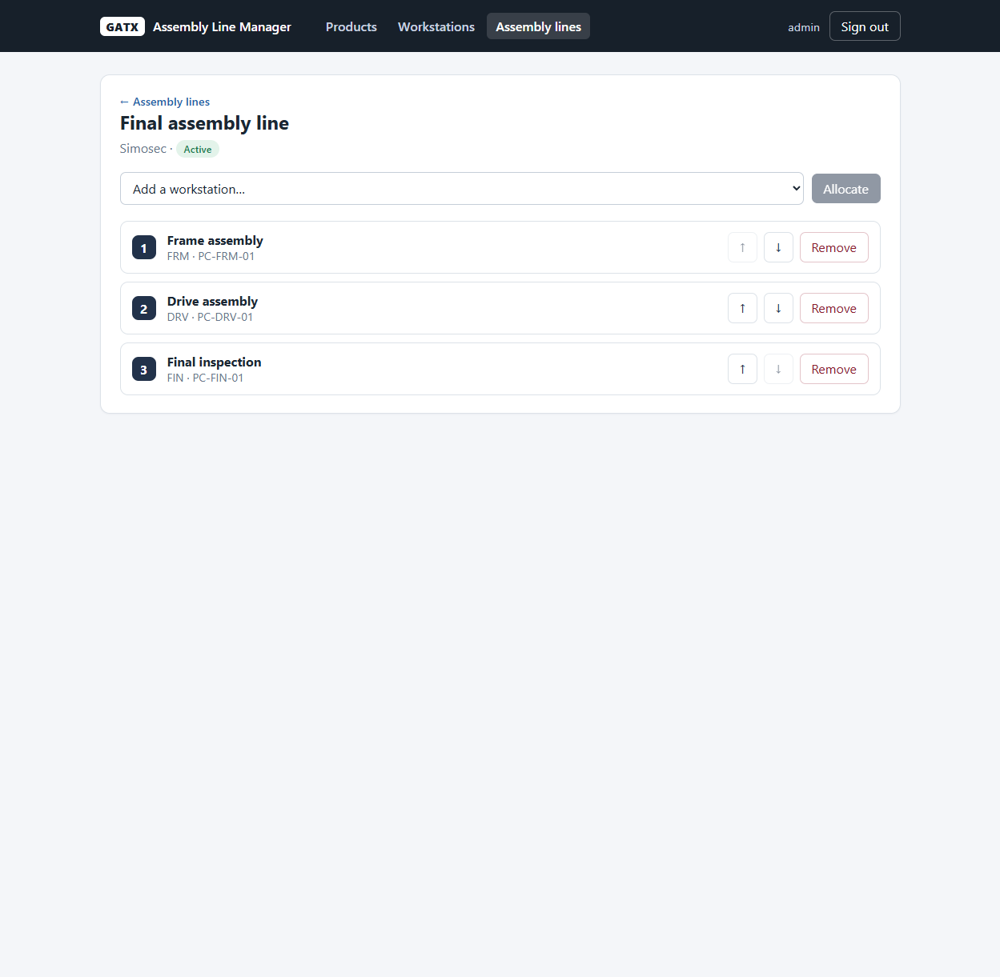

# GATX — Assembly Line Manager

A small full-stack **assembly line manager** built for the GATX stack challenge and
deployed on AWS. It lets authenticated users manage products, workstations and assembly
lines, and allocate workstations to a line in an explicit, re-orderable sequence.

The stack is the one defined in [`project.md`](project.md): a .NET 8 Clean Architecture
API with PostgreSQL, and a React 18 + TypeScript + Vite frontend, containerised with
Docker and provisioned on AWS with Terraform.



---

## Table of contents

- [Features](#features)
- [Tech stack](#tech-stack)
- [Data model](#data-model)
- [Architecture](#architecture)
- [Repository layout](#repository-layout)
- [Running locally](#running-locally)
- [Default credentials](#default-credentials)
- [API reference](#api-reference)
- [Testing](#testing)
- [Deploying to AWS](#deploying-to-aws)
- [Design notes & limitations](#design-notes--limitations)

---

## Features

- **Authentication** — username/password login with BCrypt-hashed passwords and JWT
  bearer tokens. Every data endpoint requires authorization; the login endpoint is the
  only anonymous one. A default user is seeded on first run.
- **Products** — create, rename, delete.
- **Workstations** — create, edit, delete (`short_name`, `name`, `pc_name`).
- **Assembly lines** — create, edit, delete; **filter by product**; toggle active.
- **Allocations** — allocate workstations to a line, **reorder with up/down controls**
  (positions stay contiguous), and remove. A workstation can be allocated to many lines;
  a line keeps its workstations in an explicit order.

Use cases covered, end to end: user login → manage products → manage assembly lines
(CRUD + filter by product) → manage workstations → manage allocations (allocate, reorder,
remove).

## Tech stack

| Part        | Technologies |
| ----------- | ------------ |
| Backend     | .NET 8, ASP.NET Core Web API, C# 12 |
| Patterns    | Clean Architecture, CQRS (MediatR), FluentValidation, ProblemDetails, Serilog |
| Persistence | Entity Framework Core + PostgreSQL (Npgsql) |
| Auth        | JWT bearer (`System.IdentityModel.Tokens.Jwt`), BCrypt password hashing |
| Frontend    | React 18, TypeScript (strict), Vite, React Router, TanStack Query, pnpm, Nx-style workspace |
| Container   | Multi-stage Dockerfiles, Docker Compose |
| Cloud / IaC | AWS (EC2, RDS, ECR, CloudWatch billing alarm), Terraform |
| CI          | GitHub Actions skeleton |

## Data model

| Entity                  | Fields |
| ----------------------- | ------ |
| Product                 | `name` |
| AssemblyLine            | `name`, `active`, `productId` |
| Workstation             | `short_name`, `name`, `pc_name` |
| AssemblyLineWorkstation | `assemblyLineId`, `workstationId`, `position` (the ordered allocation) |
| User                    | `username`, `passwordHash` |

**Relationships**

- One assembly line belongs to one product; a product can have many assembly lines.
- One assembly line has many workstations, allocated in an explicit `position` order.
- One workstation can be allocated to many assembly lines.

## Architecture

### Backend (Clean Architecture)

```
Gatx.Domain          Entities and business invariants (no dependencies)
Gatx.Application     CQRS requests/handlers, DTOs, validators, interfaces
Gatx.Infrastructure  EF Core DbContext + configurations, JWT + password hashing
Gatx.WebApi          Thin controllers, auth wiring, exception middleware, seeding
```

- Controllers are thin and delegate to MediatR (`ISender`).
- Each feature is a vertical slice: `Products/`, `Workstations/`, `AssemblyLines/`
  (with `Allocations/`), `Auth/`.
- A `ValidationBehavior` pipeline runs FluentValidation before each handler.
- `ExceptionHandlingMiddleware` maps exceptions to ProblemDetails:
  validation → 400, `UnauthorizedAccessException` → 401, `KeyNotFoundException` → 404,
  `InvalidOperationException` → 409.
- Allocation ordering uses a two-phase position rewrite so the unique
  `(assemblyLineId, position)` index is never transiently violated during a reorder.

### Frontend (feature-based React)

```
src/
  app/        App routes + Layout (top nav, sign out)
  shared/
    api/      apiClient (bearer token + ProblemDetails parsing + 401 handling) and
              per-resource API modules (products, workstations, lines, auth)
    auth/     AuthContext (token in localStorage), ProtectedRoute
  features/
    login/        LoginPage
    products/     ProductPage
    workstations/ WorkstationPage
    lines/        LinePage (list + filter + CRUD), LineDetailPage (allocations)
```

Server state is managed with TanStack Query; mutations invalidate the relevant queries.
A 401 from any request clears the token and redirects to `/login`.

## Repository layout

```
backend/      .NET solution (src/ + tests/)
frontend/     React app in an Nx-style pnpm workspace (apps/assembly-manager)
infra/        Terraform (EC2 + RDS + ECR + billing) and deploy.ps1
docs/         Design spec and screenshots
docker-compose.yml   Local Postgres + API + frontend
```

## Running locally

**Requirements:** .NET SDK 8, Node.js 20+, pnpm 11, Docker Desktop.

### Everything with Docker Compose

```powershell
docker compose up --build
```

- Frontend: http://localhost:4200
- API Swagger: http://localhost:5080/swagger
- Health check: http://localhost:5080/health

On first start the API creates the schema (`EnsureCreated`) and seeds the default user
and sample data.

### Backend only

```powershell
dotnet restore backend/GATX.sln
dotnet build   backend/GATX.sln
dotnet test    backend/GATX.sln
dotnet run --project backend/src/Gatx.WebApi/Gatx.WebApi.csproj
```

The API needs a PostgreSQL connection string (`ConnectionStrings__DefaultConnection`) and
a JWT secret (`Jwt__Secret`); local defaults live in `appsettings.json`.

### Frontend only

```powershell
corepack enable
pnpm install
pnpm --filter assembly-manager dev   # http://localhost:4200, proxies /api to :5080
```

## Default credentials

Seeded on first run (override with `Auth__DefaultUsername` / `Auth__DefaultPassword`):

```
username: admin
password: admin123
```

## API reference

All routes except `POST /api/auth/login` and `/health` require
`Authorization: Bearer <token>`.

| Method | Route | Purpose |
| ------ | ----- | ------- |
| POST   | `/api/auth/login` | Obtain a JWT |
| GET    | `/api/products` | List products |
| POST   | `/api/products` | Create a product |
| PUT    | `/api/products/{id}` | Rename a product |
| DELETE | `/api/products/{id}` | Delete a product |
| GET    | `/api/workstations` | List workstations |
| POST   | `/api/workstations` | Create a workstation |
| PUT    | `/api/workstations/{id}` | Update a workstation |
| DELETE | `/api/workstations/{id}` | Delete a workstation |
| GET    | `/api/assembly-lines?productId=` | List lines (optional product filter) |
| GET    | `/api/assembly-lines/{id}` | Get one line |
| POST   | `/api/assembly-lines` | Create a line |
| PUT    | `/api/assembly-lines/{id}` | Update a line |
| DELETE | `/api/assembly-lines/{id}` | Delete a line |
| GET    | `/api/assembly-lines/{id}/workstations` | List ordered allocations |
| POST   | `/api/assembly-lines/{id}/workstations` | Allocate a workstation |
| PUT    | `/api/assembly-lines/{id}/workstations/order` | Reorder allocations (`workstationIds[]`) |
| DELETE | `/api/assembly-lines/{id}/workstations/{workstationId}` | Remove an allocation |

Example login:

```bash
curl -X POST http://localhost:5080/api/auth/login \
  -H 'Content-Type: application/json' \
  -d '{"username":"admin","password":"admin123"}'
```

## Testing

xUnit handler tests run against the EF Core in-memory provider:

```powershell
dotnet test backend/GATX.sln
```

They cover product creation, assembly-line creation and product filtering, the allocation
add → reorder → remove cycle (position integrity), and login (valid/invalid).

Frontend type-check + production build:

```powershell
pnpm --filter assembly-manager build
```

## Deploying to AWS

The Terraform in `infra/terraform` provisions a small, free-tier-oriented stack in one
region: an **EC2** instance running both containers via Docker Compose, a **PostgreSQL
RDS** instance, two **ECR** repositories, and a **CloudWatch billing alarm**. A generated
JWT secret is passed to the API container.

> ⚠️ **Cost**: EC2 and RDS are free-tier *eligible* only on accounts within their first 12
> months. Otherwise they incur charges. Always tear down when finished.

### One-shot deploy

```powershell
# 1. Copy and fill in the variables (never commit terraform.tfvars)
cp infra/terraform/terraform.tfvars.example infra/terraform/terraform.tfvars

# 2. Build images, provision infra, push to ECR, boot the app
./infra/deploy.ps1
```

The script prints the public URL when done. The EC2 instance pulls the images and starts
the app on first boot (~3 minutes).

### Tear everything down

```powershell
./infra/deploy.ps1 -DestroyAll
```

Prerequisites: AWS CLI configured, Terraform ≥ 1.8, Docker running. To receive the billing
alarm, enable **Receive Billing Alerts** in the AWS console and confirm the SNS email.

## Design notes & limitations

- **Schema creation** uses `DbContext.Database.EnsureCreatedAsync()` plus a seeder, so the
  database can be recreated from scratch with no migration tooling. The trade-off is that
  `EnsureCreated` only builds the schema on an empty database — evolving the schema later
  means resetting the database (or switching to EF Core migrations, the recommended next
  step). Products are seeded via EF `HasData`; the remaining sample data is seeded at
  startup.
- **Auth** is intentionally simple (single seeded user, symmetric-key JWT). It demonstrates
  the pattern; a production system would add user management, refresh tokens and key
  rotation.
- Configuration is injected via environment variables (Twelve-Factor): connection string,
  JWT secret, default credentials and frontend origin.

### Sample data

Products `8DAB`, `8DJH`, `Simosec`, `NXPlus C`; ten workstations (Laser welding, Manual
welding, Drive assembly, Voltage drop test, Leakage test, HV/PD test, Final inspection,
Frame assembly, Testing, Dispatch); four lines (Convey, Manual, Final assembly, Testing)
with a sample ordered allocation on the Final assembly line.
