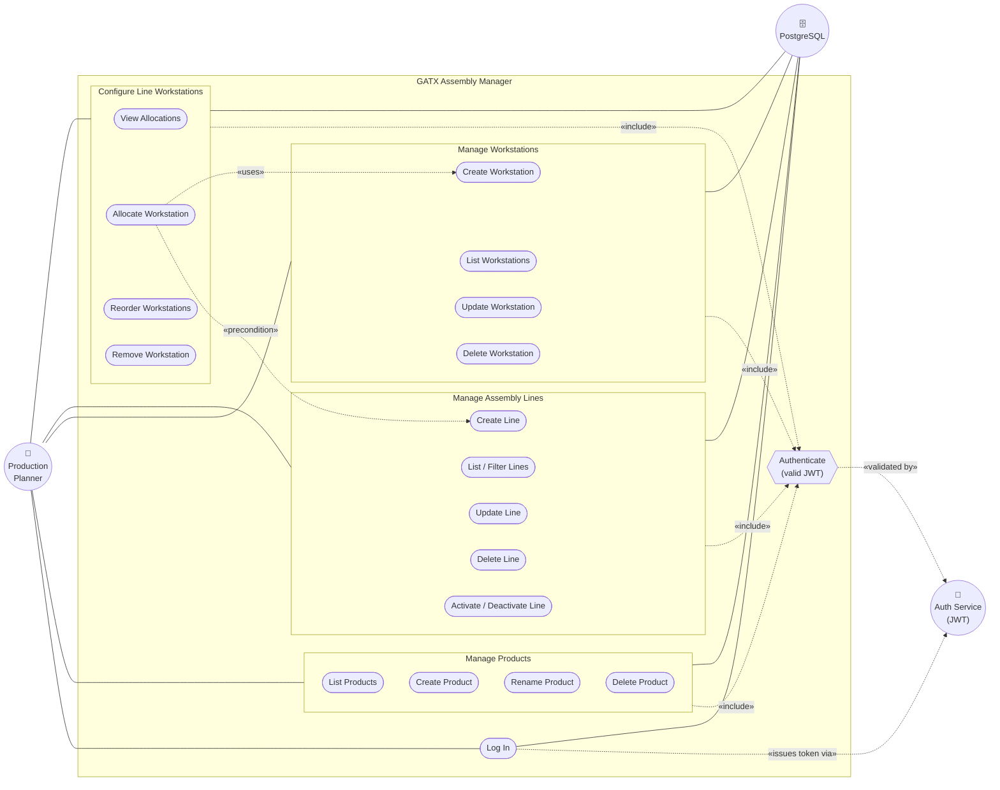

# 1. Use Case Model

The **Use Case Model** captures the functional requirements of GATX from the user's
point of view: the **actors** (roles that interact with the system) and the **use cases**
(units of useful work the system performs for those actors). It answers *"what must the
system do, and for whom?"* — deliberately saying nothing about *how*.

## 1.1 Actors

| Actor | Kind | Description |
|-------|------|-------------|
| **Production Planner** | Primary, human | The authenticated operator who configures products, workstations and assembly lines. This is the only human role; every business operation is performed by a planner. Seeded from the default user created at start-up. |
| **Authentication Service (JWT)** | Supporting | Issues and validates bearer tokens. Every business use case *includes* a valid-token check. Realised inside the system by `IJwtTokenGenerator`. |
| **PostgreSQL Database** | Supporting, system | The system of record that use cases read from and write to. |

## 1.2 Use case diagram

**Reading the diagram.** Rounded rectangles are **use cases** (UML draws these as ovals),
circles are **actors**, and the box is the **system boundary**. `Log In` is the only
use case available to an unauthenticated planner (`AllowAnonymous` on `AuthController`);
every other use case `«include»`s the **Authenticate** check because their controllers
carry `[Authorize]`. `Configure Line Workstations` depends on lines and workstations
already existing.

## 1.3 Traceability to the API

Each use case maps to concrete controller endpoints, which keeps the model honest.

| Use case | HTTP endpoint(s) | Controller |
|----------|------------------|------------|
| Log In | `POST /api/auth/login` | `AuthController` |
| List Products | `GET /api/products` | `ProductsController` |
| Create / Rename / Delete Product | `POST` / `PUT /{id}` / `DELETE /{id}` `/api/products` | `ProductsController` |
| List Workstations | `GET /api/workstations` | `WorkstationsController` |
| Create / Update / Delete Workstation | `POST` / `PUT /{id}` / `DELETE /{id}` `/api/workstations` | `WorkstationsController` |
| List / Filter Lines | `GET /api/assembly-lines?productId=` | `AssemblyLinesController` |
| Create / Update / Delete / (De)activate Line | `POST` / `PUT /{id}` / `DELETE /{id}` `/api/assembly-lines` | `AssemblyLinesController` |
| View Allocations | `GET /api/assembly-lines/{id}/workstations` | `AssemblyLinesController` |
| Allocate Workstation | `POST /api/assembly-lines/{id}/workstations` | `AssemblyLinesController` |
| Reorder Workstations | `PUT /api/assembly-lines/{id}/workstations/order` | `AssemblyLinesController` |
| Remove Workstation | `DELETE /api/assembly-lines/{id}/workstations/{workstationId}` | `AssemblyLinesController` |

## 1.4 Use case specifications

UML use cases are described by a structured narrative. Two representative cases follow.

### UC-01 · Log In

- **Actor:** Production Planner
- **Goal:** Obtain a bearer token that authorises further requests.
- **Preconditions:** The planner has a valid username and password (a default user is seeded at start-up).
- **Postconditions (success):** A signed JWT is returned and stored client-side; the planner is authenticated.
- **Main flow:**
  1. Planner submits username and password.
  2. System validates the request is non-empty (`LoginCommandValidator`).
  3. System looks up the user by username.
  4. System verifies the password against the stored hash (`IPasswordHasher.Verify`).
  5. System generates a JWT for the user (`IJwtTokenGenerator`).
  6. System returns `{ token, username }`.
- **Alternate flows:**
  - *2a. Empty username/password* → `400 Bad Request` with validation errors.
  - *3a/4a. Unknown user or wrong password* → `401 Unauthorized` ("Invalid username or password").

### UC-09 · Allocate Workstation to Line

- **Actor:** Production Planner
- **Goal:** Append a workstation to the end of an assembly line's ordered route.
- **Preconditions:** Planner is authenticated; the target line and workstation both exist.
- **Postconditions (success):** A new allocation exists at `max(position) + 1`; the full ordered allocation list is returned.
- **Main flow:**
  1. Planner selects a line and a workstation to add.
  2. System confirms the line exists (`EnsureLineExistsAsync`).
  3. System confirms the workstation exists.
  4. System confirms the workstation is not already allocated to this line.
  5. System computes the next position as `max(existing position) + 1`.
  6. System persists a new `AssemblyLineWorkstation` and saves.
  7. System returns the reloaded, position-ordered allocation list.
- **Alternate flows:**
  - *2a. Line not found* → `404` (`KeyNotFoundException`).
  - *3a. Workstation not found* → `404`.
  - *4a. Already allocated* → `409`/`400` (`InvalidOperationException` — "already allocated").

The runtime realisation of these flows is shown in the [Dynamic Model](02-dynamic-model.md).
