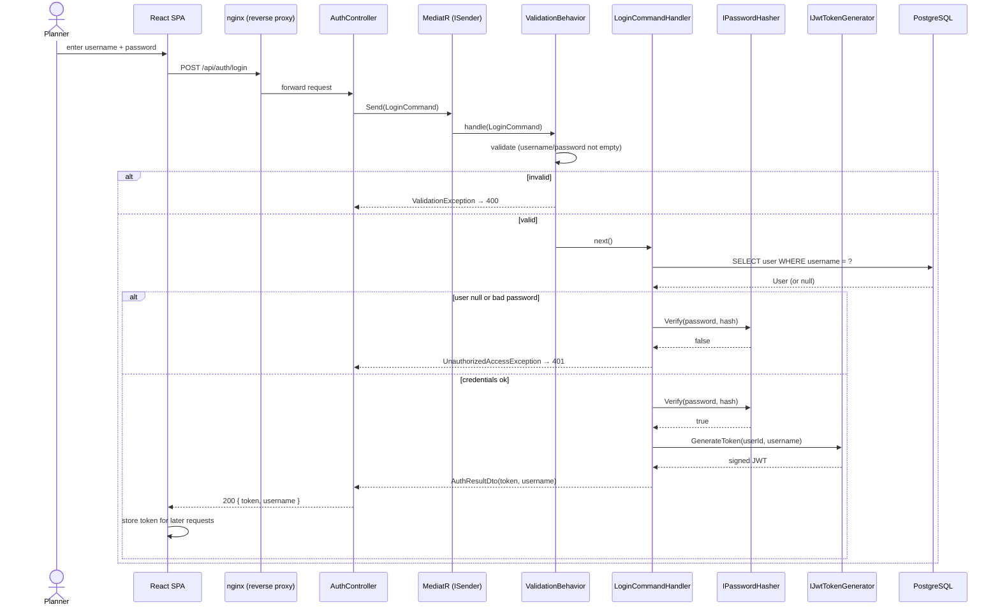
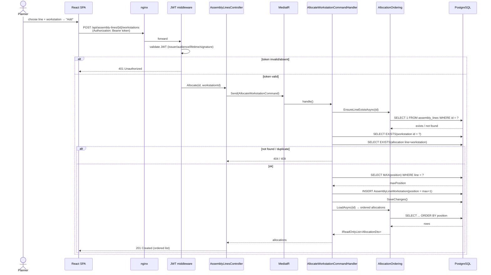
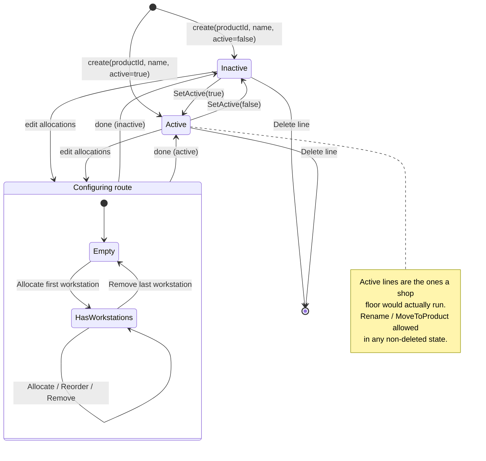
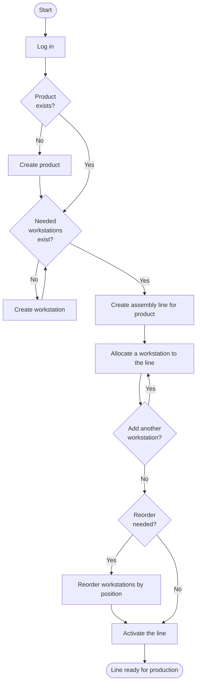

# 2. Dynamic Model

The **Dynamic Model** describes system *behaviour* — how objects collaborate and how
state changes over time. UML offers several behavioural diagrams; this document uses the
three most informative for GATX:

- **Sequence diagrams** — the message exchange that realises a use case.
- **State machine diagram** — the lifecycle of the key domain object (`AssemblyLine`).
- **Activity diagram** — the end-to-end planner workflow.

## 2.1 Sequence — Log In (UC-01)

Shows how a request travels through the Clean Architecture layers. Note the **MediatR
pipeline**: the request is *sent*, a validation behaviour runs first, then the handler.

## 2.2 Sequence — Allocate Workstation to Line (UC-09)

Illustrates a write path with multiple invariant checks before persistence, and the
bearer-token authorisation gate that every business request passes through.

## 2.3 State machine — AssemblyLine lifecycle

An `AssemblyLine` is a stateful domain object. Its `Active` flag and its collection of
allocations define the states below. Guards/effects reference the domain methods
(`SetActive`, `Rename`, `MoveToProduct`, allocation commands).

## 2.4 Activity — Configure an assembly line (end-to-end)

The typical planner workflow, spanning several use cases, expressed as a UML activity
diagram with a decision node and a loop.

Together these diagrams cover the two runtime "shapes" of GATX — a **read/authenticate**
path and a **validated write** path — plus the lifecycle of its central entity. The
static structure those messages operate on is defined in the
[Logical Model](03-logical-model.md).
