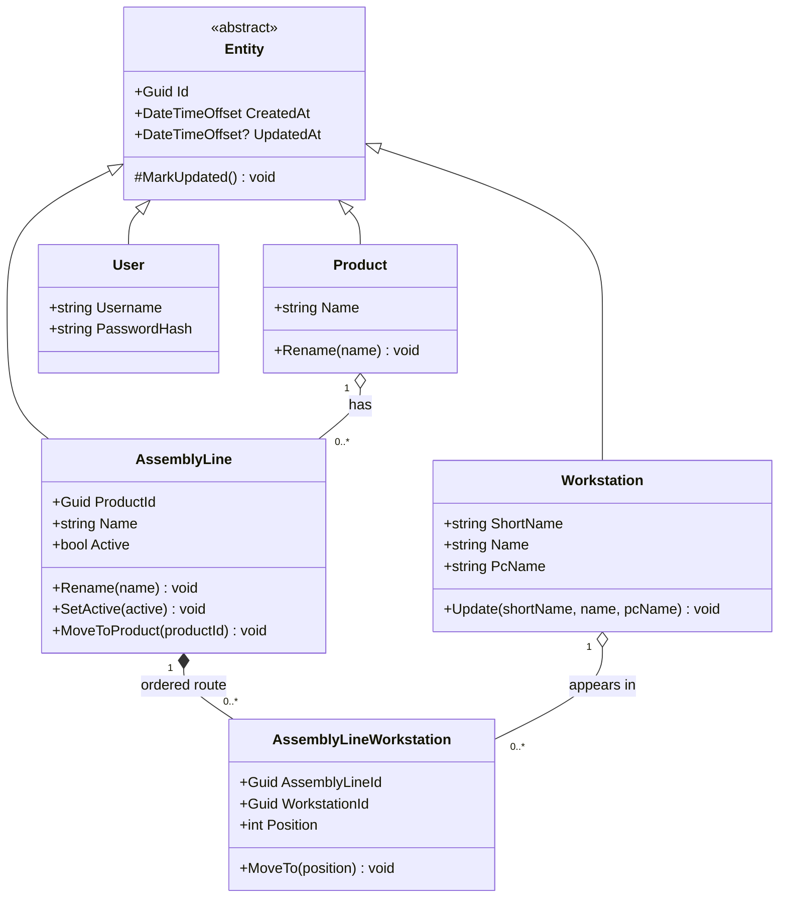
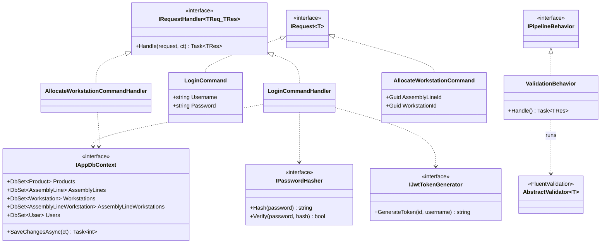

# 3. Logical Model

The **Logical Model** (a.k.a. the static structural view) defines the *things* in the
system and their relationships, independent of any runtime or deployment concern. For
GATX this is expressed as UML **class diagrams**: first the domain model (the heart of
the system), then the application-layer CQRS structure that operates on it.

## 3.1 Domain class diagram

The domain layer (`Gatx.Domain`) contains rich, encapsulated entities. All persistent
entities extend the `Entity` base class, which supplies identity and audit timestamps.
Note the private setters and factory constructors — invariants are enforced inside the
entity, not by callers.

**Key relationships**

| Relationship | Multiplicity | Meaning |
|--------------|--------------|---------|
| `Product` → `AssemblyLine` | 1 → 0..* | A product may have many assembly lines; each line builds exactly one product (`ProductId`). |
| `AssemblyLine` → `AssemblyLineWorkstation` | 1 → 0..* (composition) | A line owns an *ordered* set of allocations. The strong (filled-diamond) composition reflects that allocations have no meaning without their line. |
| `Workstation` → `AssemblyLineWorkstation` | 1 → 0..* | A workstation can appear on many lines, each time at its own `Position`. |
| `User` | — | Standalone; used only for authentication. |

`AssemblyLineWorkstation` is an **association class** with a payload (`Position`): it
resolves the many-to-many between `AssemblyLine` and `Workstation` into an *ordered*
relationship. `Position` starts at 1 and is enforced in the constructor and `MoveTo`.

## 3.2 Application-layer class diagram (CQRS)

The application layer (`Gatx.Application`) applies **CQRS with MediatR**. Every operation
is a `Command` or `Query` (an `IRequest<T>`) with a paired handler; cross-cutting
validation runs as a MediatR pipeline behaviour. Handlers depend only on *interfaces*,
which the Infrastructure layer implements (see the [Component Model](04-component-model.md)).

**Command / Query inventory** (each is an `IRequest<T>` with a handler and, where it
mutates, a `FluentValidation` validator):

| Feature | Commands | Queries |
|---------|----------|---------|
| Auth | `LoginCommand` | — |
| Products | `Create`, `Update`, `Delete` | `GetProductsQuery` |
| Workstations | `Create`, `Update`, `Delete` | `GetWorkstationsQuery` |
| Assembly Lines | `Create`, `Update`, `Delete` | `GetAssemblyLines`, `GetAssemblyLineById` |
| Allocations | `AllocateWorkstation`, `RemoveAllocation`, `ReorderAllocations` | `GetAllocationsQuery` |

The domain entities are exposed to callers as flat **DTOs** (`ProductDto`,
`AssemblyLineDto`, `WorkstationDto`, `AllocationDto`, `AuthResultDto`) so the API never
leaks the encapsulated domain objects. How these logical classes are packaged into
deployable units is the subject of the [Component Model](04-component-model.md).
