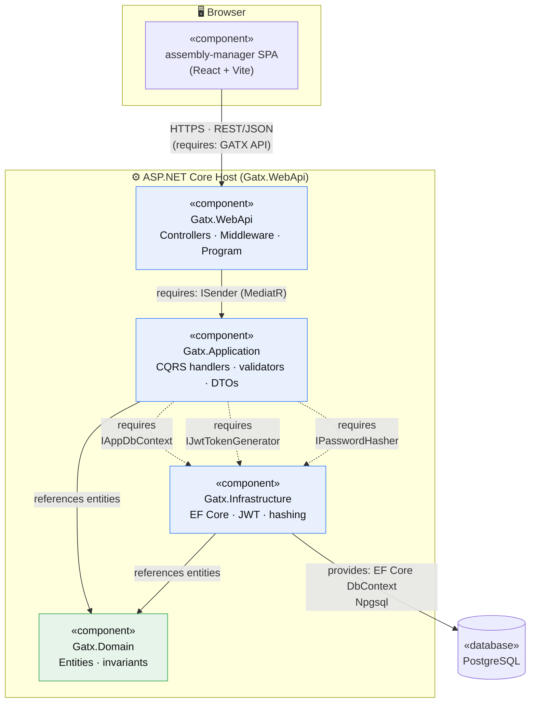
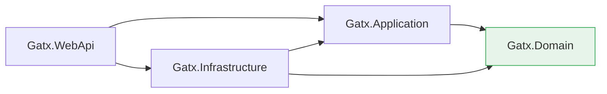

# 4. Component Model

The **Component Model** shows how the logical classes are packaged into replaceable,
independently-versioned units and how those units depend on one another through
**provided** and **required interfaces**. GATX follows **Clean Architecture**: source
dependencies point *inward*, toward the domain, and the outer layers are plugged in
through interfaces.

## 4.1 Component diagram

**Legend.** Solid arrows are compile-time (assembly) references; dashed arrows are
runtime dependencies satisfied by **dependency injection** through an interface — the
classic Clean-Architecture *dependency inversion*. `Gatx.Application` declares the
interfaces it needs (`IAppDbContext`, `IJwtTokenGenerator`, `IPasswordHasher`) and
`Gatx.Infrastructure` *provides* the implementations, wired up at start-up.

## 4.2 Components and responsibilities

| Component | Assembly / package | Provides | Requires |
|-----------|--------------------|----------|----------|
| **assembly-manager SPA** | `frontend/apps/assembly-manager` (Vite build → static assets) | The user interface | GATX REST API over HTTPS |
| **Gatx.WebApi** | `Gatx.WebApi.dll` (ASP.NET host) | REST endpoints, Swagger, JWT auth middleware, exception handling, CORS, DB seeding | `ISender` (MediatR), auth config |
| **Gatx.Application** | `Gatx.Application.dll` | Commands, queries, handlers, validators, DTOs, business rules | `IAppDbContext`, `IJwtTokenGenerator`, `IPasswordHasher` |
| **Gatx.Domain** | `Gatx.Domain.dll` | Entities and their invariants — no outward dependencies | *(nothing — the core)* |
| **Gatx.Infrastructure** | `Gatx.Infrastructure.dll` | EF Core `AppDbContext` (`IAppDbContext`), `JwtTokenGenerator`, `PasswordHasher`, DI registration | PostgreSQL connection, JWT options |

## 4.3 Dependency direction (why it's Clean)

- **`Gatx.Domain`** depends on nothing — it is the stable core.
- **`Gatx.Application`** depends only on the domain and its own abstractions.
- **`Gatx.Infrastructure`** implements those abstractions (EF Core, JWT, hashing).
- **`Gatx.WebApi`** is the composition root: it references Application and Infrastructure
  and wires them together (`AddApplication()`, `AddInfrastructure(config)` in `Program.cs`).

This means the database, the token technology, and the hashing algorithm can all be
swapped by replacing **`Gatx.Infrastructure`** alone, with no change to the domain or the
use-case handlers. The runtime placement of these components onto physical/virtual nodes
is described in the [Physical Model](05-physical-model.md).
