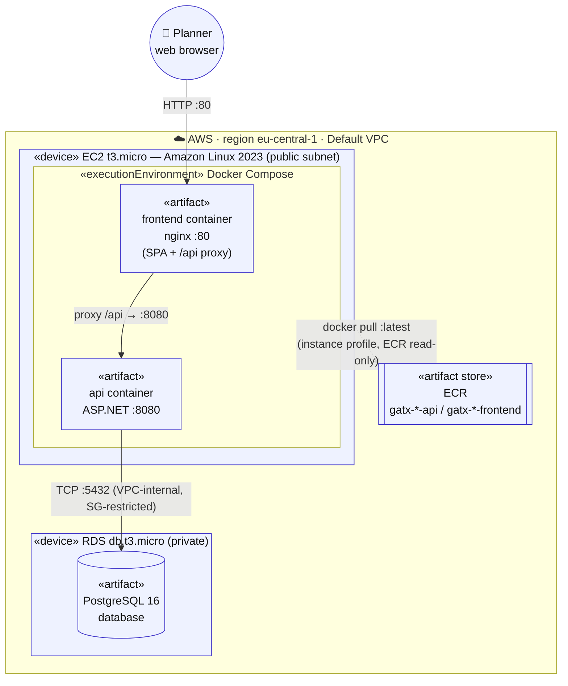
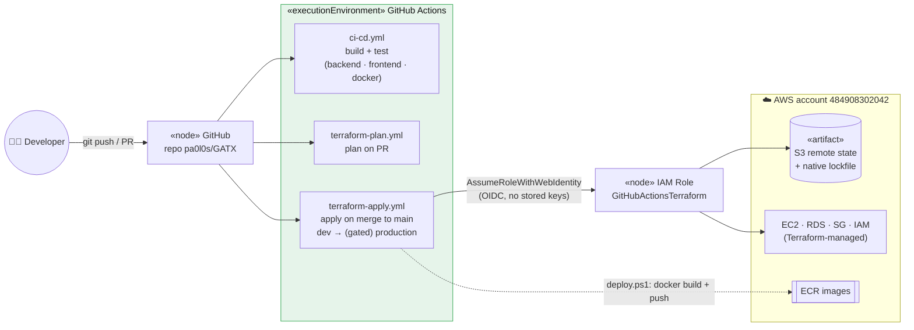

# 5. Physical Model

The **Physical Model** (UML **deployment view**) shows *where* the software runs: the
execution nodes (devices and execution environments), the artifacts deployed onto them,
and the communication paths between them. It also covers how those artifacts get there —
the CI/CD pipeline that builds and provisions everything.

## 5.1 Runtime deployment diagram

The running system is intentionally minimal and free-tier friendly: a **single EC2
instance** runs both containers via Docker Compose, talking to a managed **RDS
PostgreSQL** instance inside the default VPC.

**Node & artifact notes**

| Node / artifact | Detail |
|-----------------|--------|
| **EC2 t3.micro** | Amazon Linux 2023, 30 GB gp2 root, public subnet in the default VPC. Bootstrapped by `userdata.sh.tpl`: installs Docker + Compose, logs in to ECR, writes `docker-compose.yml`, `docker-compose up -d`. An hourly cron re-authenticates to ECR (tokens expire after 12 h). |
| **frontend container** | nginx serving the built SPA on port 80 and reverse-proxying `/api` to the api container. The only publicly exposed port (SG allows 80 and 22). |
| **api container** | ASP.NET Core on :8080, `ASPNETCORE_ENVIRONMENT=Production`; reads DB connection string and JWT secret from environment. Not published to the internet directly — reached only via the nginx proxy. |
| **RDS PostgreSQL 16** | `db.t3.micro`, 20 GB, `publicly_accessible = false`, reachable only from inside the VPC via a security group that allows :5432 from the VPC CIDR. |
| **ECR** | Two repositories per environment (`-api`, `-frontend`). EC2 pulls with an instance-profile role holding `AmazonEC2ContainerRegistryReadOnly`. |
| **IAM / access** | EC2 role also carries `AmazonSSMManagedInstanceCore`, so the box is managed via SSM Session Manager (no SSH key pair required). |

## 5.2 Deployment / CI-CD pipeline

The artifacts above are produced and placed by GitHub Actions using **OIDC federation**
(no long-lived AWS keys stored in GitHub). Terraform provisions the infrastructure;
`deploy.ps1` builds and pushes the container images.

**Pipeline stages**

1. **`ci-cd.yml`** — on every push/PR: restore/build/test the .NET solution, build the
   frontend (Node 22 + pnpm), and build both Docker images (validation only).
2. **`terraform-plan.yml`** — on PR: `terraform plan` for `dev` and `production`
   (matrix), posting the plan as a PR comment. No approval gate, so plans stay fast.
3. **`terraform-apply.yml`** — on merge to `main`: `apply-dev` runs automatically, then
   `apply-production` runs **only after manual approval** (GitHub Environment required
   reviewer). State lives in **S3** with native lockfile locking; auth is via **OIDC**
   into `GitHubActionsTerraform`.

## 5.3 Environments and a free-tier constraint

Two environments are defined — **dev** (`gatx-dev`) and **production** (`gatx-prod`) —
each with its own Terraform root, state key, EC2, RDS and ECR repos.

> ⚠️ **Free-plan account limitation.** The AWS account backing this project is a
> *free-plan* account, which caps the number of **RDS instances** (and low-tier EC2) that
> can exist at once. `dev` already consumes that single RDS slot, so `apply-production`
> fails with `InstanceQuotaExceeded`. The infrastructure code is correct — the two
> environments simply cannot run **simultaneously** on this account tier. To run
> production, either destroy `dev` first, share a single database across environments, or
> upgrade the account. See the repository's CI/CD notes for the current operational state.

This completes the five UML views: from *what* the system does
([Use Cases](01-use-case-model.md)), through *how* it behaves
([Dynamic](02-dynamic-model.md)) and *what* it is made of
([Logical](03-logical-model.md), [Component](04-component-model.md)), to *where* it runs
(this Physical model).
